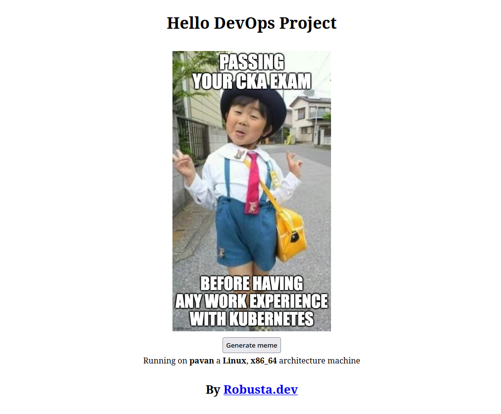
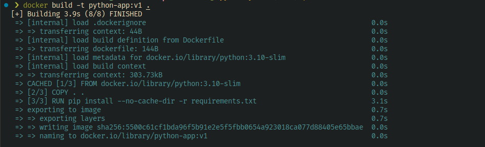

# 🔥Your First Docker Container
In this project, we will containerize and run an application using Docker. The main goal of using Docker is to make an app portable and reproducible.

## 🎯 What you'll learn
* Writing a Dockerfile 
* Creating your first Docker image

## 🛑 Prerequisites
* [Docker](https://docs.docker.com/get-docker/) installed on your machine.
* [Python](https://www.python.org/) and [pip](https://pip.pypa.io/en/stable/) installed. Don't worry, you don't need to know how to code in Python. 


## Introduction
We will use a simple Python application as the base project and containerize it using Docker. This application gets a meme from Reddit and displays it as shown below. 



## Initial Setup

Download the repo with our code and switch to `hello-devops-project/code/meme-generator/`
    ```bash linenums="1"
    git clone https://github.com/robusta-dev/Hello-DevOps-Project.git
    cd hello-devops-project/code/meme-generator/
    ```
## Run Python application locally

Before we jump into containerizing the app, let's see how we can run it locally on your machine. This will help us understand the required steps to run a python app.

The following commands, install required packages and starts the application. 
```py linenums="1"
pip install -r requirements.txt
python main.py
```

Navigate to [http://localhost:5000](http://localhost:5000) on your browser to see the app exposed on port `5000`.


## Create the Dockerfile

A **Dockerfile** contains instructions to containerize an application. In this case, we will write the instructions to build and containerize our python app. 

To do this, we will follow these steps

1. Get a Docker image with python preinstalled
```yaml linenums="1"
FROM python:3.10-slim
```
2. Copy the code from the directory into the Docker image.
```yaml linenums="1" 
COPY . .
```
3. Install required packages using pip
```yaml linenums="1"
RUN pip install --no-cache-dir -r requirements.txt 
```
4. Give the command that's needs to be run when the container is created. Here we are running `main.py` file. 
```yaml linenums="1"
CMD ["python", "main.py"]
```

This is the result of the previous steps. 
    ``` docker linenums="1" title="Dockerfile"
    FROM python:3.10-slim 
    COPY . .
    RUN pip install --no-cache-dir -r requirements.txt
    CMD ["python", "main.py"]
    ```

## Build the Docker image

A Docker image is a binary package with your app, dependencies and startup command baked into it.

Anyone with the Docker image can run your application without any issues.

Run the following command to build the docker image
```yaml linenums="1"
docker build -t python-app:v1 . # (1)!
```

1.  **What are these arguments for?**

    `-t` - Used to tag the image, in this case `v1`. You can create multiple versions of the same image with different tags.

    `.` - The period specifies that the Dockerfile in the current directory be used to build the image. You can also provide a path to the Dockerfile if its in a different location.

??? success "Output"

    


## Run the container
The image we created is stored on our system. Let's run the image and create your first container
```yaml linenums="1"
docker run -p 5000:5000 python-app:v1 # (1)!
```

1.  What is this argument for?

    `-p` - Lets you specify `PortToBeExposed:ContainerPort`, in this case `5000:5000`. 
    
    If you use `docker run -p 6000:5000 python-app:v1`, you will be able to access the application using [http://localhost:6000](http://localhost:6000)

??? success "Output"

    


Navigate to [http://localhost:5000](http://localhost:5000) to see the running app.
???+ note
    The application ends as soon as you use `CTRL+C` or close your terminal. If you want the application on the background use `docker run -d -p 5000:5000 python-app:v1`. 
    
    `-d` - This argument lets you run your container in the background.

Voilà!!🎉 There we have your first Docker container. Well, done.👏

## ❓3 Questions to check your Docker understanding

1. If Dockerfile is a cake recipe, the image is a ___________.
2. In the command `docker run -p 8000:5000`, *8000 refers to ___________* and *5000 refers to ___________*. 
3. The point of containerizing an app is ___________. 

Tweet your answers tagging @RobustaDev.  

## 🥷3 Steps to master Dockerfile
1. Redo the exercise.
2. Deploy a similar app using [this guide](https://docs.docker.com/language/python/build-images/) from Docker docs.
3. Containerize [this](https://github.com/darkmavis1980/flask-python-3-docker) application. 